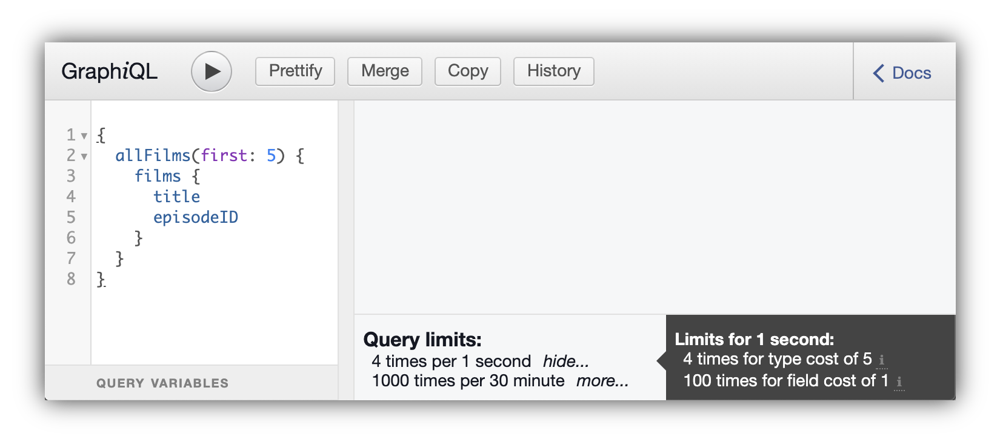

# GraphiQL Cost Plugin
Plugin for the GraphiQL IDE that displays GraphQL query cost and rate limit information.

<p align="center">

</p>

## Usage
The plugin is intended to be rendered in a `<GraphiQL.Footer>`. An example usage looks like this:

```javascript
<GraphiQL fetcher={/* pass fetcher here */}>
  <GraphiQL.Footer>
    <CostPlugin
      dataAvailability={/* See details below */}
      costData={/* See details below */}
    />
  </GraphiQL.Footer>
</GraphiQL>
```

The `CostPlugin` expects two props:

* `dataAvailability` is an enum indicating the state of fetching cost data. Possible values are:
  * `'NONE'` to indicate that no data has been loaded, e.g., when initializing GraphiQL
  * `'LOADING'` to indicate that cost data is currently being loaded
  * `'ERROR'` to indicate that there was an error loading cost data
  * `'AVAILABLE'` to indicate data is available and should be rendered (when passing available, the `costData` prop is expected to be passed a valid value)
* `costData` is an object containing cost and rate limit data. Its structure is documented in the [`CostEndpointResponse` type definition](src/types.ts).

For an example of how to use this plugin, checkout the [example folder in this repo](example/).

**Note:** This plugin defines `react` as a peer dependency. I.e., it expects your application to depend on `react`.


## Development
Before being able to build this project, install the dependencies:

```
npm i
```

...and install the `react` peer dependency:

```
npm i react --no-save
```

Then, run the development mode (watch code and rebuild on changes):

```
npm run dev
```


...or build the code for publishing:

```
npm run build
```

## License

[MIT](./LICENSE.md)
